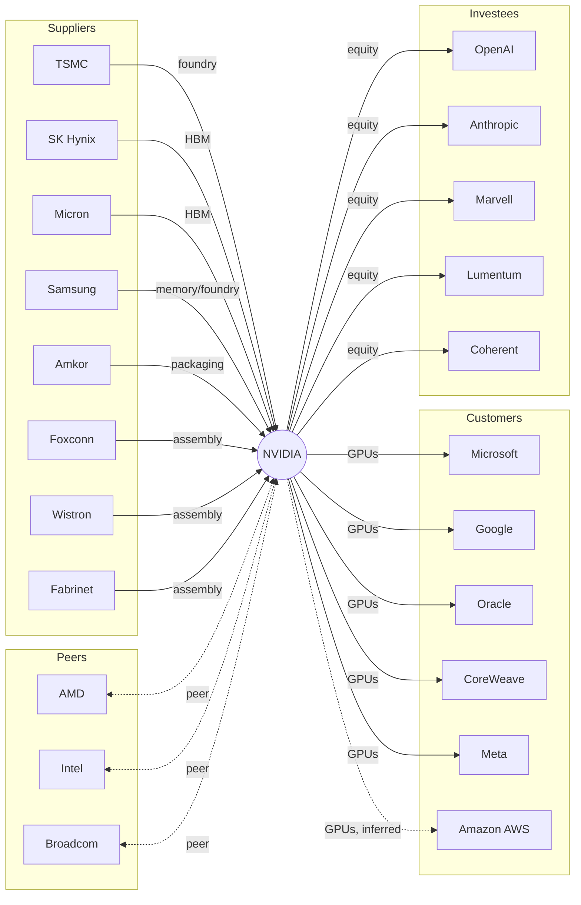

# ProofWeave

[](https://github.com/Duckweed-yhb/ProofWeave/actions/workflows/ci.yml)

**English** · [中文](./README.md)

**Reproducible supply-chain & partnership graph for NVIDIA — every relation scored, sourced, and traceable.**

This repository is the deliverable for the ARTi R&D hiring challenge. It answers the prompt:
> *Choose NVIDIA or Unitree. Based on legal, publicly accessible sources, build a reproducible supply-chain & partnership research service. The goal is not a summary — it is to link conclusions, evidence, timeliness, direction, and an explainable score, so a reviewer can read, run, and audit the judgement.*

---

## 1. Research subject & snapshot

| | |
|---|---|
| **Focal company** | NVIDIA Corporation |
| **Ticker / exchange** | NVDA · NASDAQ |
| **Snapshot date** | **2026-09-29** |
| **Primary filings used** | NVIDIA FY2026 Form 10-K (filed 2026-02-25, period ended 2026-01), NVIDIA Q2 FY2027 10-Q (period ended 2026-07-26) |
| **Coverage** | 23 listed (and 2 private) counterparties, 25 relationships across `supplier / customer / partner / investor_or_investee / peer` |
| **Out of scope** | Consumer-geography revenue splits, product-roadmap bets, non-public contract terms, any target price. |

> **Disclaimer.** This snapshot is for research reproducibility. It is **not investment advice**.

### At a glance



Solid = `confirmed`; dashed = `inferred` / `peer`. Full edge list with scores is served at `/graph`.

## 2. Quick start

Requires Python ≥ 3.11.

```bash
# 1. create a venv
python -m venv .venv
# Windows:
.\.venv\Scripts\Activate.ps1
# macOS/Linux:
# source .venv/bin/activate

# 2. install (editable) + dev deps
pip install -e ".[dev]"

# 3. run tests  (should print 23 passed)
pytest -q

# 4. start the HTTP API
uvicorn proofweave.api:app --reload --port 8123
#   then open http://127.0.0.1:8123/docs for interactive Swagger
```

No secrets, no `.env` required. See `.env.example` only if you later extend the re-crawler.

## 3. CLI

```bash
proofweave summary                                   # one-line-per-relation digest
proofweave list --type supplier --min-score 80        # JSON filter
proofweave show nvda-tsmc-foundry                    # single relation with evidence
proofweave graph --out graph.json                    # export node/edge graph
```

## 4. HTTP JSON API

All endpoints read the on-disk snapshot; **no network calls are made at request time**.

| Method | Path | What it does |
|---|---|---|
| GET | `/health` | Snapshot date, counts. |
| GET | `/stats` | One-shot aggregation: counts by relation_type / status, score buckets. |
| GET | `/companies` | All company nodes (including SEC CIK for US filers). |
| GET | `/relationships` | Filter + paginate. Query params: `relation_type`, `status`, `direction`, `min_score`, `object_company`, `limit` (1-200), `offset`. |
| GET | `/relationships/{id}` | Single relation with full evidence list. 404 if unknown. |
| GET | `/graph` | Nodes + edges for visualisation. |

Examples:

```bash
curl "http://127.0.0.1:8123/relationships?relation_type=supplier&min_score=90"
curl "http://127.0.0.1:8123/relationships/nvda-amkor-packaging"
curl "http://127.0.0.1:8123/relationships?status=unknown"     # the deliberately-unknown row
```

Input validation returns **422** on bad enums / out-of-range pagination; unknown IDs return **404**.

## 5. Data model

```
Company   { id, name, ticker, exchange, cik?, is_listed }
Evidence  { url, publisher, published_at, accessed_at, locator, access_note, quote? }
Relationship {
    id, subject, object_company,
    relation_type  ∈ supplier | customer | partner | investor_or_investee | peer,
    direction      ∈ inbound  (counterparty → NVIDIA) | outbound (NVIDIA → counterparty) | both,
    status         ∈ confirmed | inferred | unknown,
    as_of, rationale, evidence[], quantitative_note?, uncertainty_note?, score
}
```

Every field is explained inline in `proofweave/models.py`.

## 6. Scoring (0–100, fully additive)

The score is **re-derived at load time** from the evidence list — it is never hand-written into JSON. Formula:

```
base              70 confirmed / 40 inferred / 15 unknown
+ evidence_count  min(n_evidence, 5) × 3
+ independence   min(distinct_publishers, 5) × 4
+ recency         newest evidence ≤180d → +10, ≤365d → +6, ≤730d → +3
+ quantitative    +8 if a public number anchors the claim (e.g. "~19% of TSMC revenue")
− penalty        −10 if inferred but only one publisher; −20 if unknown
= clamp(0, 100)
```

The breakdown (`base / evidence_count_bonus / independence_bonus / recency_bonus / quantitative_bonus / penalty / total / rationale`) is exposed on every relation so a reviewer can re-derive every point by hand. See `proofweave/scoring.py`.

## 7. Sources & compliance

All data comes from **public, no-auth, no-paywall** sources:

- **SEC EDGAR** NVIDIA filings (CIK 0001045810) — 10-K FY2026, 10-Q Q2 FY2027.
- **NVIDIA official newsroom / blog** (`nvidianews.nvidia.com`, `blogs.nvidia.com`).
- **Counterparty official pages** — `amkor.com`, `cloud.google.com/blog`.
- **Established financial press** — Nasdaq, Korea Herald, Counterpoint, CTOL.

We do **not** bypass robots, login, paywalls, CAPTCHAs, or rate limits. No API keys, personal data, or client-confidential material is committed. The snapshot JSON is shipped in-repo so a reviewer does **not** need to re-crawl anything.

### Deliberate boundary case

10-K R14 discloses that **three direct customers accounted for 30%, 18%, and ~1x% of revenue** but does **not name them**. We ship this as a row with `status=unknown` and score ~20, and we explicitly refuse to guess "the 30% customer is Microsoft". Guessing is the kind of news-co-occurrence error the prompt warns against.

## 8. AI usage disclosure (challenge item #10)

- **AI assistance used for:** drafting boilerplate structure, suggesting Pydantic field names, locating public URLs via search, and explaining error messages.
- **Human (Hongbin Yu) responsible for:** choosing NVIDIA as the subject, curating every relation, classifying each as `confirmed / inferred / unknown`, picking the evidence URLs and verbatim quotes, designing the scoring formula, and writing the final README.
- **No AI tool was given:** API keys, personal data, client-confidential data, or any non-public source.
- Every URL in the snapshot was opened and checked against the prompt before being committed.

## 9. Known limitations & future work

- **HBM per-vendor split** (SK Hynix ~50-60%, Samsung ~25-30%, Micron remainder) is an *analyst estimate*, not a NVIDIA disclosure — flagged as such on the row.
- **AWS / Amazon** is marked `inferred` because no NVIDIA primary filing names it; promoting it would require a primary source.
- **Peer classification** uses industry consensus, not a formal GICS pull; we did not call a third-party GICS API to avoid introducing a paid dependency.
- **No live re-crawler** is wired up yet. To refresh, edit `proofweave/data/snapshot_<date>.json`, re-run `pytest`, and bump the `_DEFAULT_SNAPSHOT` constant in `loader.py`.
- Edge cases NOT covered yet: time-travel queries at an arbitrary `as_of`, multi-hop graph traversal, and merging duplicate companies across exchanges.

## 10. Layout

```
proofweave/
├── models.py            # Pydantic schemas
├── scoring.py           # additive 0-100 engine
├── api.py               # FastAPI JSON API
├── cli.py               # typer CLI
└── data/
    ├── loader.py
    └── snapshot_2026_09_29.json   # the frozen, auditable deliverable
tests/                    # 23 tests, incl. 404 / 422 / pagination / unknown-row
```

## 11. License

MIT.
