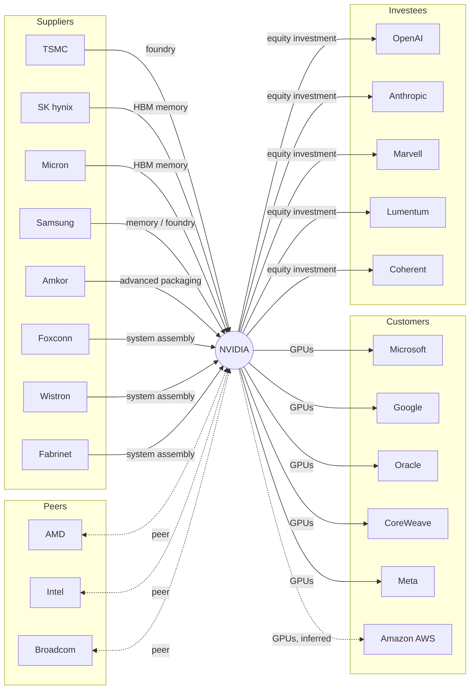

# ProofWeave

[](https://github.com/Duckweed-yhb/ProofWeave/actions/workflows/ci.yml)

**English** · [中文](./README.md)

**A reproducible NVIDIA supply-chain and partnership graph — every relationship scored, sourced, traceable, and self-checking.**

This repository is the deliverable for the ARTi R&D challenge. The brief:
> *Pick either NVIDIA or Unitree, and build a reproducible supply-chain and partnership research service from legally accessible public sources. The goal is not a summary — it is to connect relationship conclusions, evidence, recency, direction and an explainable score so that a reviewer can understand, run, and trace your judgement.*

---

## 1. Subject and snapshot

| | |
|---|---|
| **Focal company** | NVIDIA Corporation |
| **Listing** | NVDA · NASDAQ |
| **Snapshot date** | **2026-09-29** |
| **Primary filings** | NVIDIA FY2026 Form 10-K (filed 2026-02-25, FY ending 2026-01); NVIDIA Q2 FY2027 10-Q (period ending 2026-07-26) |
| **Coverage** | **24 company nodes** (21 listed + 3 unlisted: OpenAI, Anthropic, and a synthetic "anonymous customer" node), **23 counterparties**, **25 relationships** across `supplier / customer / partner / investor_or_investee / peer` |
| **Not covered** | Revenue by geography, product-roadmap bets, non-public contract terms, any price target. |

There are more relationships (25) than counterparties (23) because Microsoft and Alphabet are each both a customer and a partner, which is one row each.

> **Disclaimer**: this snapshot exists for research reproduction only. It is **not investment advice**.

### The graph at a glance



Solid = `confirmed`; dashed = `inferred` / `peer`. The full scored edge list is at `/graph`.

The 23 nodes drawn above exclude the synthetic "anonymous customer" node — the 24th company, which exists only as a `status=unknown` row (see §8).

## 2. Quick start

Requires Python ≥ 3.11.

```bash
# 1. create a virtual environment
python -m venv .venv
# Windows:
.\.venv\Scripts\Activate.ps1
# macOS/Linux:
# source .venv/bin/activate

# 2. install (editable) + dev dependencies
pip install -e ".[dev]"

# 3. run the tests  (should print 114 passed, 1 skipped)
pytest -q

# 4. self-check the snapshot: structure, evidence, and score reproducibility
proofweave audit

# 5. start the HTTP API
uvicorn proofweave.api:app --reload --port 8123
#   then open http://127.0.0.1:8123/docs for interactive Swagger
```

No keys and no `.env` are needed. `.env.example` only matters if you later add a crawler.

> The one skipped test is the `proofweave graph` file-writing case: in a restricted environment that has no writable temporary directory (a low-integrity sandbox, for instance) it skips with a reason instead of pretending to pass.

## 3. Command line

```bash
proofweave summary                                   # one line per relationship, with evidence age
proofweave list --type supplier --min-score 80        # filtered JSON
proofweave list --max-age-days 180                    # only recent evidence
proofweave list --published-after 2026-06-01          # only evidence published since a date
proofweave show nvda-tsmc-foundry                    # one relationship with its full evidence
proofweave graph --out graph.json                    # export the node/edge graph
proofweave neighbors tsmc --hops 2                   # subgraph within N hops of a company
proofweave path tsmc microsoft                       # shortest path between two companies
proofweave audit                                     # snapshot self-check (non-zero exit if inconsistent)
proofweave stale --max-age-days 365                  # relationships whose evidence has aged out
proofweave version                                   # version
```

`audit` exits 1 when the snapshot is inconsistent, 3 when something is not found, and 2 on bad input, so it drops straight into CI or a script.

## 4. HTTP JSON API

Every endpoint is served from the on-disk snapshot. **No network calls are made at request time.**

| Method | Path | Notes |
|---|---|---|
| GET | `/` | Entry point: version, snapshot date, available endpoints. |
| GET | `/health` | Snapshot date, relationship/company counts, version. |
| GET | `/stats` | One-shot aggregation: counts by type/status, score buckets, newest and oldest evidence dates. |
| GET | `/audit` | Snapshot self-check: structural invariants plus every score recomputed and compared. |
| GET | `/companies` | All company nodes (with SEC CIK for US filers). |
| GET | `/relationships` | Filter + paginate. Params: `relation_type`, `status`, `direction`, `min_score`, `object_company`, `published_after`, `max_age_days`, `limit` (1-200), `offset`. |
| GET | `/relationships/{id}` | One relationship with its full evidence list. 404 when absent. |
| GET | `/graph` | Nodes + edges for visualisation. |
| GET | `/graph/neighbors/{company_id}` | Induced subgraph within `hops` (1-3) of a company; each node carries `hop_distance`. |
| GET | `/graph/path` | Shortest path between two companies; params `source`, `target`, `max_hops` (1-3). |
| GET | `/stale` | Relationships with the oldest evidence; param `max_age_days`. |

Examples:

```bash
curl "http://127.0.0.1:8123/relationships?relation_type=supplier&min_score=90"
curl "http://127.0.0.1:8123/relationships/nvda-amkor-packaging"
curl "http://127.0.0.1:8123/relationships?status=unknown"        # the deliberately-unknown row
curl "http://127.0.0.1:8123/relationships?max_age_days=90"       # only evidence under 90 days old
curl "http://127.0.0.1:8123/graph/neighbors/tsmc?hops=2"
curl "http://127.0.0.1:8123/graph/path?source=tsmc&target=microsoft"
curl "http://127.0.0.1:8123/audit"
```

Bad enum values or out-of-range pagination return **422**; an unknown id, an unknown company, or a pair not reachable within `max_hops` returns **404**.

Traversal treats the graph as **undirected**: asking "who is connected to this supplier" should reach NVIDIA even though the stored edge points *at* NVIDIA. The stored `direction` field still carries the directional meaning for display.

## 5. Data model

```
Company   { id, name, ticker, exchange, cik?, is_listed }
Evidence  { url, publisher, published_at, accessed_at, locator, access_note, quote? }
Relationship {
    id, subject, object_company,
    relation_type  ∈ supplier | customer | partner | investor_or_investee | peer,
    direction      ∈ inbound  (counterparty → NVIDIA) | outbound (NVIDIA → counterparty) | both,
    status         ∈ confirmed | inferred | unknown,
    as_of, rationale, evidence[], quantitative_note?, uncertainty_note?, score
}
```

Every field is documented in `proofweave/models.py`. All models are **frozen**: a loaded snapshot is a deliverable and the API caches it process-wide, so in-place mutation would leak one request's edits into every later request. Freezing makes that a loud error instead of a silent one.

## 6. Scoring (0–100, purely additive)

Scores are **derived from the evidence at load time** and never hand-written into JSON:

```
base              confirmed 70 / inferred 40 / unknown 15
+ evidence_count    +3 per piece of evidence, capped at 5
+ independence     +4 per distinct publisher, capped at 5
+ recency           +10 if the newest evidence was *published* within 180 days,
                    +6 within 365, +3 within 730
+ quantitative      +8 when a public figure anchors the claim
− penalty           −10 if inferred from a single publisher; −20 if unknown
= clamp(0, 100)
```

Every term (`base / evidence_count_bonus / independence_bonus / recency_bonus / quantitative_bonus / penalty / total / rationale`) is returned with the relationship. The recency term additionally reports the `newest_evidence_date` and `evidence_age_days` it was measured against, so a reviewer can re-derive each point by hand — including *which date* the points were awarded for. See `proofweave/scoring.py`.

**Recency is measured on the date the evidence was published, not the date we fetched it.** In a frozen snapshot those almost always differ: every source is fetched on the same day, so scoring on the access date would hand every relationship the same full bonus and the term would measure nothing. `accessed_at` is only a fallback for undated sources.

## 7. Snapshot self-check and staleness

`proofweave audit` (or `GET /audit`) turns "every number can be checked" into a runnable command. It verifies:

- **Structure**: dangling edges, duplicate relationship ids, company keys that disagree with `Company.id`.
- **Evidence**: at least one piece of evidence per relationship, an http(s) URL, non-empty publisher/locator, nothing accessed before it was published, and no evidence dated after the snapshot.
- **That the scores really are derived**: every score is recomputed from its evidence and compared field by field. A score hand-edited into the JSON is reported, and CI fails.
- **That the scoring terms still discriminate**: if the recency term takes the same value for every relationship it has degenerated into a constant and measures nothing — exactly the bug fixed in 0.2.0, now an alerting check.

Current snapshot: `checks run : 191 / errors : 0 / warnings : 0 / verdict : OK`.

`proofweave stale` (or `GET /stale`) answers the other question a reviewer will ask: **which conclusions rest on evidence that has gone stale?** The oldest row today is `nvda-oracle-customer`, whose newest evidence stops at 2025-03-18 — 560 days old.

## 8. Sources and compliance

Every fact comes from **public, no-login, no-paywall** sources:

- **SEC EDGAR** NVIDIA filings (CIK 0001045810) — FY2026 10-K, Q2 FY2027 10-Q.
- **NVIDIA newsroom / blog** (`nvidianews.nvidia.com`, `blogs.nvidia.com`).
- **Counterparty official pages** — `amkor.com`, `cloud.google.com/blog`.
- **Established financial press** — Nasdaq, Korea Herald, Counterpoint, CTOL.

We do **not** bypass robots, logins, paywalls, captchas or rate limits. No secrets, personal data or customer-confidential material are in this repository. The snapshot JSON is committed, so a reviewer reproduces everything **without re-crawling anything**.

### A deliberately preserved boundary case

10-K R14 discloses that **three direct customers accounted for 30%, 18% and roughly 1x% of revenue** without naming them. We store it as one `status=unknown` row scoring 16 and explicitly **refuse to guess** that the 30% customer is Microsoft. Guessing is precisely the "news co-occurrence" error the brief warns about.

## 9. AI usage statement (challenge item 10)

- **AI was used for**: drafting boilerplate structure, suggesting Pydantic field names, locating public URLs via search, explaining error messages.
- **I (余泓彬 / Hongbin Yu) am responsible for**: choosing NVIDIA as the subject, selecting every relationship, classifying each as `confirmed / inferred / unknown`, choosing the evidence URLs and verbatim quotes, designing the scoring formula, and writing this README.
- **No AI tool was given**: API keys, personal data, customer-confidential or any non-public material.
- Every URL in the snapshot was opened and checked by hand before submission.

## 10. Known limitations and future work

- **HBM market shares** (SK hynix ~50-60%, Samsung ~25-30%, Micron the rest) are *analyst estimates*, not NVIDIA disclosures — flagged on the row itself.
- **AWS / Amazon** is marked `inferred` because no NVIDIA primary document names it; upgrading it needs a first-party source.
- **Peer classification** uses industry consensus rather than a formal GICS pull; no paid GICS API was introduced on purpose.
- **No live crawler yet.** To refresh: edit `proofweave/data/snapshot_<date>.json`, re-run `pytest` and `proofweave audit`, and update `_DEFAULT_SNAPSHOT` in `loader.py`. You can also point `PROOFWEAVE_SNAPSHOT` at a new file first to try it out.
- **The graph is a single-subject star**: every relationship's `subject` is NVIDIA, so although `neighbors` / `path` are implemented as general multi-hop traversal, any two nodes are at most 2 hops apart with this data. Real multi-hop value needs a second subject.
- Edge cases not yet covered: time-travel queries at an arbitrary `as_of` (every relationship shares one `as_of`, so such a query would be vacuous), and merging duplicate companies across exchanges.

## 11. Repository layout

```
proofweave/
├── models.py            # Pydantic models (all frozen)
├── scoring.py           # the 0-100 additive scoring engine
├── graph.py             # filtering + traversal, shared by API and CLI so they cannot drift
├── audit.py             # snapshot self-check: structure, evidence, score reproducibility
├── api.py               # FastAPI JSON API (every route declares a response_model)
├── cli.py               # typer command line
└── data/
    ├── loader.py         # loads and re-scores (honours PROOFWEAVE_SNAPSHOT)
    └── snapshot_2026_09_29.json   # the frozen, auditable deliverable
tests/                    # 115 tests: API / CLI / scoring / traversal / audit / loader / invariants
CHANGELOG.md              # release notes, including the 0.2.0 recency fix
```

## 12. License

MIT.
