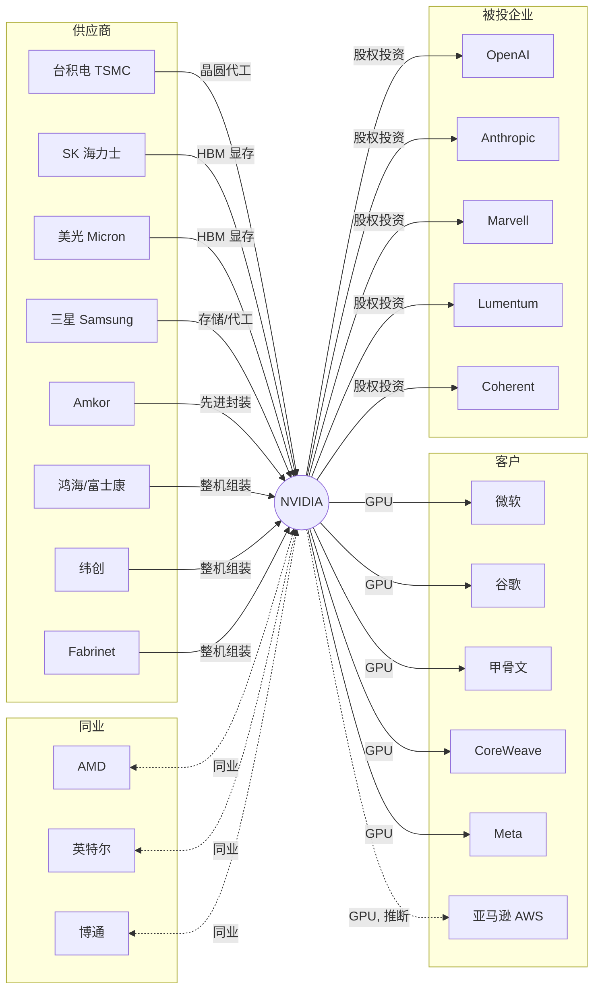

# ProofWeave

[](https://github.com/Duckweed-yhb/ProofWeave/actions/workflows/ci.yml)

[English](./README.en.md) · **中文**

**可复现的 NVIDIA 供应链与合作关系图谱 —— 每条关系都有评分、有出处、可追溯、可自检。**

本仓库是 ARTi 研发岗位挑战的交付物。题目要求：
> *在 NVIDIA 与宇树科技中任选其一，基于合法可访问的公开资料，构建一个可复现的供应链与合作关系研究服务。目标不是生成一段摘要，而是将关系结论、证据、时效、方向和可解释评分连接起来，让 reviewer 可以理解、运行和追溯你的判断。*

---

## 1. 研究对象与快照

| | |
|---|---|
| **研究主体** | NVIDIA Corporation（英伟达） |
| **证券标识** | NVDA · 纳斯达克 |
| **快照日期** | **2026-09-29** |
| **主要参考文件** | NVIDIA FY2026 Form 10-K（2026-02-25 提交，截至 2026-01 财年）、NVIDIA Q2 FY2027 10-Q（截至 2026-07-26） |
| **覆盖范围** | **24 家公司节点**（21 家上市 + 3 家未上市：OpenAI、Anthropic，以及合成节点"匿名客户"），**23 个交易对手**，**25 条关系**，覆盖 `supplier / customer / partner / investor_or_investee / peer` 五类 |
| **不覆盖** | 分地区收入、产品路线图押注、非公开合同条款、任何目标价。 |

关系数（25）多于交易对手数（23），是因为微软与 Alphabet 各自同时是客户与合作方，各占两行。

> **免责声明**：本快照仅用于研究复现，**不构成投资建议**。

### 关系图谱一览



实线 = `confirmed`（已确认）；虚线 = `inferred`（推断）/ `peer`（同业）。带评分的完整边列表见 `/graph` 接口。

图中画出的 23 个节点不含那个合成的"匿名客户"节点；它在数据里是第 24 家，只以 `status=unknown` 的形式存在（见 §8）。

## 2. 快速开始

需要 Python ≥ 3.11。

```bash
# 1. 创建虚拟环境
python -m venv .venv
# Windows:
.\.venv\Scripts\Activate.ps1
# macOS/Linux:
# source .venv/bin/activate

# 2. 安装（可编辑模式）+ 开发依赖
pip install -e ".[dev]"

# 3. 跑测试（应输出 115 passed）
pytest -q

# 4. 自检快照：结构、证据、以及"分数确实由公式算出"
proofweave audit

# 5. 启动 HTTP API
uvicorn proofweave.api:app --reload --port 8123
#   然后浏览器打开 http://127.0.0.1:8123/docs 看交互式 Swagger
```

无需任何密钥或 `.env`。只有当你后续扩展爬虫时才需要参考 `.env.example`。

> 其中「把图导出成文件」的那个用例需要一个可写的临时目录。在无法写入临时目录的受限环境里
> （例如低完整性级别的沙箱），它会带原因跳过而不是伪装成通过，此时输出为 `114 passed, 1 skipped`。
> 正常机器和 CI 上都是 `115 passed`。

## 3. 命令行

```bash
proofweave summary                                   # 一行一条关系的速览（含证据龄）
proofweave list --type supplier --min-score 80        # JSON 筛选输出
proofweave list --max-age-days 180                    # 只要证据够新的
proofweave list --published-after 2026-06-01          # 按证据发布日筛选
proofweave show nvda-tsmc-foundry                    # 单条关系含完整证据
proofweave graph --out graph.json                    # 导出节点/边图
proofweave neighbors tsmc --hops 2                   # 某公司 N 跳内的子图
proofweave path tsmc microsoft                       # 两家公司间最短路径
proofweave audit                                     # 快照自检（不一致时退出码非 0）
proofweave stale --max-age-days 365                  # 证据过期的关系
proofweave version                                   # 版本号
```

`audit` 在不一致时返回退出码 1、找不到对象返回 3、参数非法返回 2，可直接接进 CI 或脚本。

## 4. HTTP JSON API

所有接口都从磁盘快照读取，**请求时不发起任何网络调用**。

| 方法 | 路径 | 说明 |
|---|---|---|
| GET | `/` | 入口：版本、快照日期、可用接口列表。 |
| GET | `/health` | 快照日期、关系/公司数量、版本。 |
| GET | `/stats` | 一键聚合：按关系类型/状态计数、分数桶分布、最新/最旧证据日期。 |
| GET | `/audit` | 快照自检报告：结构不变量 + 每条分数按公式重算比对。 |
| GET | `/companies` | 全部公司节点（含美国上市公司 SEC CIK 编号）。 |
| GET | `/relationships` | 筛选 + 分页。参数：`relation_type`、`status`、`direction`、`min_score`、`object_company`、`published_after`、`max_age_days`、`limit`（1-200）、`offset`。 |
| GET | `/relationships/{id}` | 单条关系含完整证据列表。不存在返回 404。 |
| GET | `/graph` | 导出节点 + 边，供可视化。 |
| GET | `/graph/neighbors/{company_id}` | 某公司 N 跳内的诱导子图，参数 `hops`（1-3），每个节点带 `hop_distance`。 |
| GET | `/graph/path` | 两家公司间最短路径，参数 `source`、`target`、`max_hops`（1-3）。 |
| GET | `/stale` | 证据最旧的关系，参数 `max_age_days`。 |

示例：

```bash
curl "http://127.0.0.1:8123/relationships?relation_type=supplier&min_score=90"
curl "http://127.0.0.1:8123/relationships/nvda-amkor-packaging"
curl "http://127.0.0.1:8123/relationships?status=unknown"        # 那条故意标 unknown 的边界行
curl "http://127.0.0.1:8123/relationships?max_age_days=90"       # 只要证据在 90 天内的
curl "http://127.0.0.1:8123/graph/neighbors/tsmc?hops=2"
curl "http://127.0.0.1:8123/graph/path?source=tsmc&target=microsoft"
curl "http://127.0.0.1:8123/audit"
```

非法枚举值或越界分页返回 **422**；不存在的 ID、不存在的公司、在跳数上限内仍不可达的路径返回 **404**。

遍历把关系图当作**无向图**：从供应商问"谁和它相连"应当能到达 NVIDIA，即使存储的边是指向 NVIDIA 的。存储的 `direction` 字段仍然保留方向语义用于展示。

## 5. 数据模型

```
Company   { id, name, ticker, exchange, cik?, is_listed }
Evidence  { url, publisher, published_at, accessed_at, locator, access_note, quote? }
Relationship {
    id, subject, object_company,
    relation_type  ∈ supplier | customer | partner | investor_or_investee | peer,
    direction      ∈ inbound  (对方 → NVIDIA) | outbound (NVIDIA → 对方) | both,
    status         ∈ confirmed | inferred | unknown,
    as_of, rationale, evidence[], quantitative_note?, uncertainty_note?, score
}
```

每个字段的含义都在 `proofweave/models.py` 里有 docstring。所有模型都是**冻结的**（frozen）：加载后的快照是交付物，而 API 会在进程内缓存它，就地修改会把一次请求的改动泄漏到之后每一次请求；冻结让这种错误立刻报错，而不是悄悄生效。

## 6. 评分公式（0–100，全加法）

分数在**加载时由证据列表现算**，从不手写进 JSON：

```
base              已确认 70 / 推断 40 / 未知 15
+ evidence_count   每条证据 +3，上限 5 条
+ independence    每个不同 publisher +4，上限 5 家
+ recency          最新证据的**发布日**距快照 ≤180 天 +10，≤365 天 +6，≤730 天 +3
+ quantitative     有公开数字锚点 +8（例如"约占台积电 19% 收入"）
− penalty          推断但只有 1 家来源 −10；unknown −20
= clamp(0, 100)
```

每一项（`base / evidence_count_bonus / independence_bonus / recency_bonus / quantitative_bonus / penalty / total / rationale`）都随关系返回。`recency_bonus` 还额外带上它据以计算的 `newest_evidence_date` 与 `evidence_age_days`，reviewer 可以手算复核每一分，包括"这 6 分是对着哪个日期给的"。见 `proofweave/scoring.py`。

**recency 用的是证据的发布日，不是我们访问它的日期。** 这两者在冻结快照里几乎必然不同：所有来源都是同一天抓的，若按访问日算，每条关系都会拿到同一个满分，这一项就等于没有。只有 `published_at` 缺失的无日期来源才回退到 `accessed_at`。

## 7. 快照自检与新鲜度

`proofweave audit`（或 `GET /audit`）把"每个数字都可复核"这句话变成一条可执行的命令，它检查：

- **结构**：悬空边、重复的关系 id、公司键与 `Company.id` 不一致；
- **证据**：每条关系至少一条证据、URL 是 http(s)、publisher/locator 非空、未在发布前被访问、没有晚于快照日的证据；
- **分数确实是算出来的**：把每条关系的分数按其证据重算一遍并逐字段比对。任何被手改进 JSON 的分数都会被报出来，CI 会因此失败；
- **评分项是否还有区分度**：如果 recency 项对所有关系取值相同，说明它已经退化成常数、不再度量任何东西 —— 这正是 0.2.0 修掉的那个问题，现在它是一条会报警的检查。

当前快照：`checks run : 191 / errors : 0 / warnings : 0 / verdict : OK`。

`proofweave stale`（或 `GET /stale`）回答另一个 reviewer 一定会问的问题：**哪些结论的证据已经旧了？** 当前快照里最旧的一条是 `nvda-oracle-customer`，最新证据停留在 2025-03-18，已 560 天。

## 8. 数据来源与合规

所有数据来自**公开、免登录、无付费墙**的来源：

- **SEC EDGAR** NVIDIA 文件（CIK 0001045810）—— FY2026 10-K、Q2 FY2027 10-Q。
- **NVIDIA 官方新闻稿 / 博客**（`nvidianews.nvidia.com`、`blogs.nvidia.com`）。
- **对方公司官方页面**——`amkor.com`、`cloud.google.com/blog`。
- **主流财经媒体**——Nasdaq、Korea Herald、Counterpoint、CTOL。

我们**不**绕过 robots、登录、付费墙、验证码或限流。仓库里不包含任何密钥、个人数据或客户机密。快照 JSON 直接入库，reviewer **无需**重新抓取任何东西即可复现。

### 故意保留的边界案例

10-K R14 披露**三大直接客户分别占收入的 30%、18% 和约 1x%**，但**没有点名**。我们把它作为一行 `status=unknown`、分数 16 入库，并明确**拒绝猜测**"30% 那个客户是微软"。乱猜正是题目警告的"新闻共现误判"。

## 9. AI 使用声明（对应挑战第 10 条）

- **AI 辅助用于**：起草样板结构、建议 Pydantic 字段名、通过搜索定位公开 URL、解释报错信息。
- **本人（余泓彬）负责**：选择 NVIDIA 作为研究对象、筛选每一条关系、把每条归类为 `confirmed / inferred / unknown`、挑选证据 URL 与原文引文、设计评分公式、撰写本 README。
- **未向任何 AI 工具输入**：API 密钥、个人数据、客户机密或任何非公开资料。
- 快照里的每一个 URL 在提交前都人工打开核对过。

## 10. 已知局限与未来工作

- **HBM 各家份额**（SK 海力士约 50-60%、三星约 25-30%、美光剩余）是*分析师估计*，不是 NVIDIA 披露——已在该行明确标注。
- **AWS / 亚马逊**标为 `inferred`，因为 NVIDIA 任何一份一手文件都没点名；要升级需要找到一手来源。
- **同业分类**用的是行业共识，没有正式拉 GICS；为了不引入付费依赖，没有调用第三方 GICS API。
- **尚未接入实时爬虫**。要刷新数据时，编辑 `proofweave/data/snapshot_<date>.json`，重跑 `pytest` 与 `proofweave audit`，并更新 `loader.py` 里的 `_DEFAULT_SNAPSHOT`；也可以用 `PROOFWEAVE_SNAPSHOT` 环境变量先指向新文件试跑。
- **图是单主体的星形**：所有关系的 `subject` 都是 NVIDIA，所以遍历（`neighbors` / `path`）虽然实现为通用多跳，当前数据下任意两点最多 2 跳。要真正体现多跳的价值需要引入第二个主体。
- 尚未覆盖的边界：任意 `as_of` 的时间旅行查询（当前所有关系共用一个 `as_of`，这种查询没有意义）、跨交易所同名公司合并。

## 11. 目录结构

```
proofweave/
├── models.py            # Pydantic 数据模型（全部 frozen）
├── scoring.py           # 0-100 加法评分引擎
├── graph.py             # 筛选 + 遍历（API 与 CLI 共用，避免两边漂移）
├── audit.py             # 快照自检：结构、证据、分数可复现性
├── api.py               # FastAPI JSON API（每个路由都有 response_model）
├── cli.py               # typer 命令行
└── data/
    ├── loader.py         # 载入 + 现算分数（支持 PROOFWEAVE_SNAPSHOT 覆盖）
    └── snapshot_2026_09_29.json   # 冻结、可审计的交付物
tests/                    # 115 个测试：API / CLI / 评分 / 遍历 / 自检 / 载入 / 快照不变量
CHANGELOG.md              # 版本变更记录（含 0.2.0 修掉 recency 项的那次修订）
```

## 12. 许可证

MIT。
